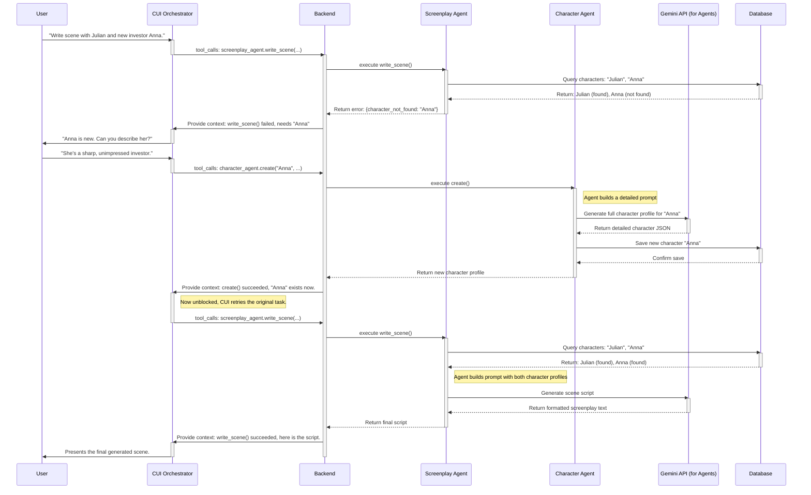

```mermaid
sequenceDiagram
    participant User
    participant CUI_Orchestrator as CUI Orchestrator
    participant Backend
    participant ScreenplayAgent as Screenplay Agent
    participant CharacterAgent as Character Agent
    participant GeminiAPI as Gemini API (for Agents)
    participant Database

    User->>CUI_Orchestrator: "Write scene with Julian and new investor Anna."
    activate CUI_Orchestrator
    CUI_Orchestrator->>Backend: tool_calls: screenplay_agent.write_scene(...)
    deactivate CUI_Orchestrator
    activate Backend

    Backend->>ScreenplayAgent: execute write_scene()
    activate ScreenplayAgent
    ScreenplayAgent->>Database: Query characters: "Julian", "Anna"
    activate Database
    Database-->>ScreenplayAgent: Return: Julian (found), Anna (not found)
    deactivate Database
    ScreenplayAgent-->>Backend: Return error: {character_not_found: "Anna"}
    deactivate ScreenplayAgent
    Backend->>CUI_Orchestrator: Provide context: write_scene() failed, needs "Anna"
    activate CUI_Orchestrator

    CUI_Orchestrator->>User: "Anna is new. Can you describe her?"
    deactivate CUI_Orchestrator
    User->>CUI_Orchestrator: "She's a sharp, unimpressed investor."
    activate CUI_Orchestrator

    CUI_Orchestrator->>Backend: tool_calls: character_agent.create("Anna", ...)
    deactivate CUI_Orchestrator
    Backend->>CharacterAgent: execute create()
    activate CharacterAgent
    note right of CharacterAgent: Agent builds a detailed prompt
    CharacterAgent->>GeminiAPI: Generate full character profile for "Anna"
    activate GeminiAPI
    GeminiAPI-->>CharacterAgent: Return detailed character JSON
    deactivate GeminiAPI
    CharacterAgent->>Database: Save new character "Anna"
    activate Database
    Database-->>CharacterAgent: Confirm save
    deactivate Database
    CharacterAgent-->>Backend: Return new character profile
    deactivate CharacterAgent

    Backend->>CUI_Orchestrator: Provide context: create() succeeded, "Anna" exists now.
    activate CUI_Orchestrator
    note right of CUI_Orchestrator: Now unblocked, CUI retries the original task.
    CUI_Orchestrator->>Backend: tool_calls: screenplay_agent.write_scene(...)
    deactivate CUI_Orchestrator

    Backend->>ScreenplayAgent: execute write_scene()
    activate ScreenplayAgent
    ScreenplayAgent->>Database: Query characters: "Julian", "Anna"
    activate Database
    Database-->>ScreenplayAgent: Return: Julian (found), Anna (found)
    deactivate Database
    note right of ScreenplayAgent: Agent builds prompt with both character profiles
    ScreenplayAgent->>GeminiAPI: Generate scene script
    activate GeminiAPI
    GeminiAPI-->>ScreenplayAgent: Return formatted screenplay text
    deactivate GeminiAPI
    ScreenplayAgent-->>Backend: Return final script
    deactivate ScreenplayAgent

    Backend->>CUI_Orchestrator: Provide context: write_scene() succeeded, here is the script.
    activate CUI_Orchestrator
    CUI_Orchestrator->>User: Presents the final generated scene.
    deactivate CUI_Orchestrator
    deactivate Backend
```
